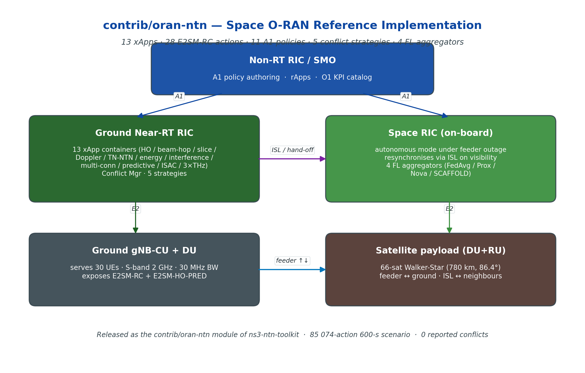

<h1 align="center">oran-ntn</h1>

<p align="center"><strong>Space O-RAN reference implementation for ns-3.43 — 13 xApps, 28 E2SM-RC actions, 11 A1 policies, 5 conflict strategies, 4 federated aggregators</strong></p>

<p align="center">
  <a href="https://www.nsnam.org"></a>
  <a href="https://www.gnu.org/licenses/old-licenses/gpl-2.0.en.html"></a>
  
  
  
</p>

<p align="center">
  
</p>

---

## Why this module

Open-RAN deployments in non-terrestrial networks reshape Near-RT RIC operations in three concrete ways: the set of serving cells rotates on a tens-of-seconds timescale, feeder-link delay varies between gateways, and the gNB radio unit itself migrates across satellites. `oran-ntn` is a working ns-3.43 reference implementation of a **Space O-RAN** architecture in which a satellite-hosted **Space RIC** cooperates with a ground-based **Near-RT RIC** via the standard E2 and A1 interfaces, with a matching E2 service model (`E2SM-HO-PRED`) that exposes LEO-specific measurements — per-candidate SINR, elevation, Doppler, and time-to-exit (TTE).

## At a glance

| Metric | Value |
|---|---|
| xApp containers shipped | **13** (HO / beam-hop / slice / Doppler / TN-NTN / energy / interference / multi-conn / predictive / ISAC / 3 × THz) |
| E2SM-RC action types | **28** |
| A1 policy types | **11** |
| Conflict-resolution strategies | 5 (PRIORITY · TEMPORAL · MERGE · A1\_GUIDED · ML\_BASED) |
| Federated aggregators | 4 (FedAvg · FedProx · FedNova · SCAFFOLD) |
| 600-s scenario (5 live xApps) | **85 074** actions, **0** reported conflicts |
| HO xApp Monte-Carlo (10 seeds × 600 s) | total HO 200±40 → **135±12**, ping-pong 57.1 % → **0 %** |

## What it does

- **Ground Near-RT RIC** + **Space RIC** (on-board, autonomous under feeder outage) — both speak standard O-RAN E2 / A1
- 13 xApp containers inheriting from a common `OranNtnXappBase`, each with O1 KPIs (P50/P95/P99 latency, drift index, decision rate)
- `E2SM-HO-PRED` service-model definition (ASN.1 sketch in [docs/](docs/)) — strict superset of legacy E2SM-RC HO
- `OranNtnConflictManager` with resource-key arbitration over a sliding window
- 4-aggregator federated-learning subsystem (FedAvg / FedProx / FedNova / SCAFFOLD), exchanged across ISL when the Space RIC takes over
- `oran-ntn-full-scenario` reference example with 5 concurrent xApps over a 600-s LEO pass

## Live demos

### 66-satellite Walker-Star with Space RICs and ISL coordination

<p align="center">
  
</p>

### Concurrent xApp decision dashboard (HO / beam-hop / slice / Doppler / TN-NTN)

<p align="center">
  
</p>

## Install & run

See [**INSTALL.md**](INSTALL.md) for full setup.

Quick taste:

```bash
git clone https://github.com/Muhammaduazir69/oran-ntn.git contrib/oran-ntn
./ns3 configure --enable-examples --enable-tests
./ns3 build
./ns3 run "oran-ntn-full-scenario --simTime=600 --xapps=ho,beamhop,slice,doppler,tnntn"
```

## Documentation

- [INSTALL.md](INSTALL.md) — full setup + dependency notes
- [docs/architecture.png](docs/architecture.png) — module architecture
- Reference paper: *A Space O-RAN Architecture and E2 Service Model for Handover Prediction*, IEEE TNSM, in submission

## Cite this work

```bibtex
@misc{uzair2026oranntn,
  author = {Uzair, Muhammad},
  title  = {oran-ntn: Space O-RAN Reference Implementation for ns-3.43},
  year   = {2026},
  url    = {https://github.com/Muhammaduazir69/oran-ntn}
}
```

## Part of the ns3-ntn-toolkit

This module is one of five custom modules bundled in [**ns3-ntn-toolkit**](https://github.com/Muhammaduazir69/ns3-ntn-toolkit):

| Module | Repo |
|---|---|
| Toolkit (umbrella) | [ns3-ntn-toolkit](https://github.com/Muhammaduazir69/ns3-ntn-toolkit) |
| ntn-cho | [ntn-cho-framework](https://github.com/Muhammaduazir69/ntn-cho-framework) |
| **oran-ntn** | this repo |
| thz-ntn | [ns3-thz-ntn](https://github.com/Muhammaduazir69/ns3-thz-ntn) |
| ns3-ai (fork) | [ns3-ai](https://github.com/Muhammaduazir69/ns3-ai) |

## License

GPL-2.0-only — see [LICENSE](LICENSE).

## Acknowledgements

ns-3 core team · SNS3 maintainers · O-RAN Alliance WG3 / WG2 specifications.
