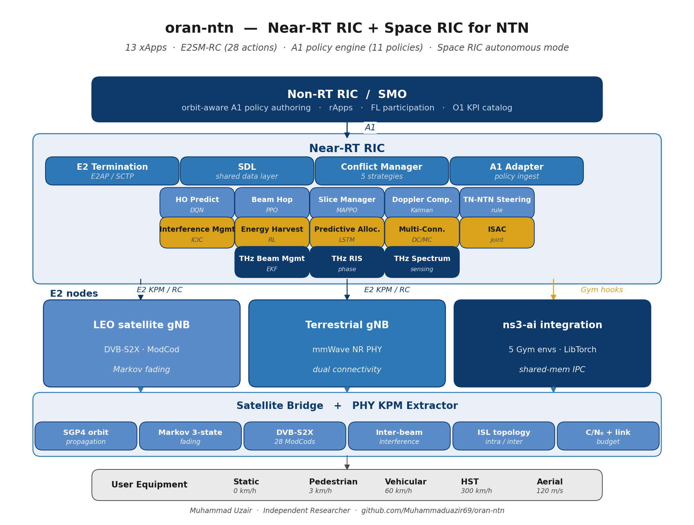

# oran-ntn

> O-RAN over Non-Terrestrial Networks: a multi-tier RIC (RT / Near-RT / Space-RIC), E2/canonical-KPM telemetry, A1 policy, xApps with conflict management, cross-domain SMO analytics, and AI-native payload/fronthaul models for ns-3.43.
> Part of **ns3-ntn-toolkit** — [README](../../README.md) / [INSTALL](../../INSTALL.md).

<p align="center">
  
</p>

| | |
|---|---|
| ns-3 version | `release ns-3.43` |
| License | GPL-2.0-only |
| Maintainer | Muhammad Uzair, Independent Researcher (ORCID 0009-0002-4104-2680) |
| Test suites | `oran-ntn`, `oran-ntn-multi-tier-ric`, `oran-ntn-ws4` |
| Default scenario | `examples/oran-ntn-full-scenario.cc` |

## Overview

`oran-ntn` brings the O-RAN disaggregated RAN control architecture to
non-terrestrial networks. It models the WG3 **Near-Real-Time RIC** with
xApp lifecycle management, an E2AP-style termination, A1 policy ingest from
a Non-RT RIC, and a multi-xApp **conflict manager**. KPM telemetry is
exported both as a flat record stream and in a **canonical KPM**
encoding (stable measurement IDs / labels). On top of the WG2/WG3 ground
control plane it adds an on-board **Space-RIC** that takes over autonomously
when the satellite loses its feeder link, and — new in the AI-native
release — a **real-time RIC tier** (`OranNtnRtRic`) co-located with the
O-DU on the satellite, whose control loop is hard-bounded below the O-RAN
10 ms RT limit and acts directly on measured PHY KPIs.

The module is built around a **real data plane**: it links against
`ntn-traffic`, whose `NtnRealStackHelper` stands up an actual mmwave NR NTN
cell (SpectrumPhy + MAC + HARQ/AMC + RLC/PDCP + RRC + EPC) on SGP4 satellite
orbits with TR 38.811 UE mobility. The KPIs the RICs consume are measured
in-band on that stack; where a scenario scales beyond what a per-packet PHY
can simulate (the full-scenario constellation), the remaining cells get a
TR 38.821-style link budget evaluated over the same live SGP4 geometry, and
every KPM row is tagged with its provenance (`phy-trace` vs
`geometry-budget`) — there are no synthetic/sine KPI generators. RIC
**placement** (on-board / HAPS / gateway / cloud) is an experiment variable
whose E2 latency is computed from the live slant geometry, and the
satellite **payload architecture** (transparent / regenerative O-RU /
O-RU+O-DU / full gNB), **fronthaul split**, **platform class**, and
**functional role switching** are first-class measurable models.

### Transport realism (read before citing E2 results)

E2AP-over-SCTP is **not** simulated. E2 indications and RC actions are
delay-modeled simulator events: one feeder-link delay on the measurement
uplink (E2 node → RIC) **and one on the control downlink (RIC → E2 node,
via `OranNtnE2Node::ReceiveRcAction()`)**, optionally aligned to the
Near-RT RIC control-loop tick. This is the same substitution ns-3 mainline
applies to the S1-AP/X2-AP control planes (direct calls / UDP instead of
SCTP), and the delay model is stated in `model/oran-ntn-e2-interface.h`.
Wire-level E2 (E2AP/ASN.1-PER over real SCTP) via `flexric-bridge/` is
roadmapped (W8, gated on the FlexRIC Docker run); the bridge's transport
stub is not yet connected to the in-sim E2 nodes.

`OranNtnE2Node` attributes controlling the E2 loop model:

| Attribute | Default | Meaning |
|---|---|---|
| `FeederLinkDelay` | 20 ms (4 ms from `CreateSatelliteE2Nodes`) | One-way feeder delay applied to EACH direction (indication uplink, RC-action downlink) |
| `MaxBufferSize` | 1000 | On-board store-and-forward buffer for reports during feeder outage |
| `AlignToControlLoop` | false | When true, delivered indications are queued and dispatched only on the next RIC control-loop tick (measure → feeder → loop tick → feeder → apply) instead of executing xApps inline |
| `ControlLoopPeriod` | 100 ms | Near-RT RIC tick period used by `AlignToControlLoop` |
| `UnixEpochOffset` | 0 | Offset (s) added to indication timestamps; set a Unix epoch to produce wall-clock-like stamps for external consumers (FlexRIC bridge) |

### Control-loop realism (read before citing "closed-loop" results)

The framework control loop is **open by default**: every xApp routed through
the Near-RT RIC ends at a registered RC-action handler
(`OranNtnE2Node::SetRcActionCallback`) whose default implementation **records
the decision** (`action_log.csv`, traces, SDL `last_action_*`) and returns
success — it does **not** itself actuate handover, scheduling, PRB allocation,
or beam selection on the live mmwave stack. So the shipped multi-xApp
scenarios (e.g. `oran-ntn-full-scenario`) are **measure → decide → log**, not
measure → act → measure.

The one example that truly **closes** a measured→act→measured loop is
`oran-ntn-ric-controlled-traffic`: it wires the action callback so an
E2SM-RC `BEAM_SWITCH` lands a real beam gain on the live channel, and the
subsequently measured SINR/TBLER/goodput recover. Treat that example as the
reference for actuation; the rest demonstrate the RIC decision logic, not
RAN actuation. (The cross-domain SMO example manipulates offered-rate caps /
routes / edge rates directly in example code, outside the xApp→E2 action
path.)

## What's new — AI-native ORAN-NTN release (June 2026)

See [`CHANGELOG.md`](CHANGELOG.md) and the toolkit
[`../../CHANGELOG.md`](../../CHANGELOG.md) for earlier releases (v2 realism
fixes, the original RIC/xApp framework).

- **Multi-tier RIC.** `OranNtnRtRic` adds the real-time tier (<10 ms,
  enforced at `Start()`) next to the existing Near-RT RIC and Space-RIC;
  `OranNtnRicPlacement` makes RIC siting (on-board satellite, HAPS, ground
  gateway, ground cloud) an experiment variable with E2 delay derived from
  the live slant range.
- **Cross-domain SMO.** `OranNtnNwdaf` (per-slice analytics + SLA-risk
  score from measured KPM), `OranNtnTpnController` (transport-path ranking
  and per-slice switching), and `OranNtnCrossDomainSmo` (one closed loop
  coordinating RAN quota, transport path, and edge compute).
- **ONNX inference xApp.** `OranNtnOnnxXapp` loads `.onnx` models exported
  from the toolkit gym environments and infers on live measured feature
  vectors. ONNX Runtime is an **optional** dependency auto-detected at
  configure time; without it the xApp transparently falls back to a
  caller-registered heuristic, so every example still runs.
- **Payload & fronthaul models.** `NtnFhSplitModel` (split options Opt 2 /
  7.2a / 7.2b / Opt 8 with one-way latency bounds and fronthaul-rate
  multipliers, plus `ChooseBestSplit()`), `NtnPlatformSpec` (UAV / HAPS /
  LEO / MEO / GEO platform classes with latency bands and enforceable UAV
  endurance), and `OranNtnRoleSwitch` (regenerative-payload role elevation
  RU → RU+DU → full gNB on measured triggers: battery telemetry, fronthaul
  latency, injected failures — with a real service-interruption window).
- **Five new examples** (see below): RIC-placement A/B, cross-domain slice
  adaptation, payload-options A/B, per-platform latency validation, and a
  post-disaster emergency-communication flagship.
- **Two new test suites**: `oran-ntn-multi-tier-ric` and `oran-ntn-ws4`.

## Models, helpers & key classes

Derived from `model/*.h` and `helper/*.h`.

### Near-RT RIC platform
- `OranNtnNearRtRic` (`model/oran-ntn-near-rt-ric.h`) — RIC kernel: xApp
  lifecycle, E2 termination, an `OranNtnSdl` shared-data layer, action
  routing, and metrics aggregation.
- `OranNtnConflictManager` (`model/oran-ntn-conflict-manager.h`) — multi-xApp
  conflict resolution; strategy selectable via `ConflictResolutionStrategy`
  (`PRIORITY_BASED`, `TEMPORAL`, `MERGE`, …). Writes `conflict_log.csv`.

### Multi-tier RIC (real-time tier & placement)
- `OranNtnRtRic` (`model/oran-ntn-rt-ric.h`) — real-time RIC co-located
  with the O-DU on the satellite, so its loop sees zero feeder-link
  latency. Registers named `RtAction`s evaluated per UE per loop against
  measured PHY KPIs (per-UE SINR / TBLER wired from `NtnRealStackHelper`
  accessors); a loop period ≥ 10 ms refuses to start (O-RAN RT bound).
- `OranNtnRicPlacement` (`model/oran-ntn-ric-placement.h`) — RIC siting as
  an experiment variable (`Site::OnBoardSatellite`, `Site::Haps`,
  `Site::GroundGateway`, `Site::GroundCloud`). `ComputeE2Delay()` derives
  the one-way E2 latency from the current slant range plus site terms;
  `BindToGeometry()` keeps an `OranNtnE2Node`'s feeder delay tracking the
  live slant range of the real (SGP4 / TR 38.811) mobility models.

### Cross-domain SMO
All in `model/oran-ntn-cross-domain.h`:
- `OranNtnNwdaf` — CN-domain analytics function: consumes
  `NtnOranAiFlowMonitor` KPM indications (measured, in-band) and maintains
  per-slice load / delay / loss EWMAs plus an SLA-risk score from the
  delay-budget headroom and trend.
- `OranNtnTpnController` — transport-domain controller: ranks registered
  transport paths by live latency (provider callbacks) and switches the
  active path per slice within its latency budget.
- `OranNtnCrossDomainSmo` — closed coordination loop across RAN (A1-style
  radio quota), transport (path selection via the TPN controller), and
  CN/edge (compute allocation), driven by NWDAF analytics only.

### AI-native inference
- `OranNtnOnnxXapp` (`model/oran-ntn-onnx-xapp.h`) — wiring for a
  train → export → infer lifecycle: train offline on the toolkit gym
  environments (`ns3-ai-ntn`; note those envs are synthetic), export to
  `.onnx`, load with ONNX Runtime, and infer on live measured feature
  vectors. **No trained `.onnx` ships**, so the default run path is the
  registered heuristic policy, not a learned model. ONNX Runtime itself is
  a real, optional dependency auto-detected by CMake (`onnxruntime_cxx_api.h`
  + `libonnxruntime`); when it (or a model) is absent, `Infer()` runs the
  heuristic. `IsOnnxAvailable()` / `IsModelLoaded()` report which path is
  live.
- Gym environments (`model/oran-ntn-gym-*.h`) — handover, beam-hop, slice,
  steering, predictive; plus `OranNtnFederatedLearning` aggregators.

### Payload, fronthaul split, platform & role switch
- `NtnFhSplitModel` (`model/oran-ntn-fh-split.h`) — 3GPP TR 38.801 / O-RAN
  WG4 fronthaul split options with one-way latency bounds and
  fronthaul-rate multipliers relative to the user-plane rate
  (Opt 2: 1.5–10 ms, ~1.05×; Opt 7.2a: ≤0.25 ms, ~10×; Opt 7.2b:
  ≤0.25 ms, ~7×; Opt 8: ≤0.25 ms, ~16×). `IsFeasible()` checks a split
  against the measured feeder one-way delay and available capacity;
  `ChooseBestSplit()` returns the most centralized feasible option —
  at LEO slant delays every lower-PHY split fails, which is the standard
  argument for regenerative payloads.
- `NtnPlatformSpec` (`model/ntn-platform-spec.h`) — per-platform-class
  constraints (UAV untethered/tethered, HAP, LEO, MEO, GEO): payload mass,
  bus power, endurance, one-way latency class, network role.
  `ScheduleEnduranceEnd()` enforces a UAV's endurance with a real
  end-of-service event.
- `OranNtnRoleSwitch` (`model/ntn-platform-spec.h`) — SMO-side functional
  role switching (RU → RU+DU → full gNB) on measured triggers: battery
  fraction, measured fronthaul latency vs. the split bound, and injected
  failures. Each switch applies after a configurable service-interruption
  window and is recorded as a `SwitchEvent`.

### E2 interface & KPM
- `OranNtnE2Node` / `OranNtnE2Termination` (`model/oran-ntn-e2-interface.h`) —
  E2AP-style subscription / indication path; `OranNtnE2Node` carries the
  feeder-link availability flag that drives Space-RIC autonomy.
- Canonical KPM IDs (`model/oran-ntn-kpm-canonical-ids.h`) — stable
  measurement and label identifiers under `ns3::oranntn::kpm` /
  `ns3::oranntn::label`, used to emit `kpm_canonical.csv`.
- KPM / RC / CCC / ephemeris service models behind a plugin ABI
  (`model/oran-ntn-service-model*.h`, `OranNtnServiceModelRegistry`),
  including E2SM-RC Style 3 connected-mode mobility
  (`model/oran-ntn-rc-style3.h`).
- Hand-written ASN.1 PER codec for E2AP / E2SM-KPM / E2SM-RC (`asn1/`) — a
  self-consistent, test-only encoder/decoder. It round-trips against itself
  but is **not bit-conformant Aligned-PER** (full-byte CHOICE index,
  octet-aligned preambles, no extension markers), so it would not decode on
  an asn1c peer; see the header. The companion SCTP/TCP E2 listener
  (`flexric-bridge/e2-listener.cc`) echoes frame **types** and does not decode
  payloads. Neither is on the in-sim control path (see *Transport realism*).
  FlexRIC-compatible field names live in `model/oran-ntn-flexric-types.h`.
- `OranNtnDataRepository` (`model/oran-ntn-data-repository.h`) — NIST-style
  data repository (in-memory; SQLite-backed when ns-3 is configured with
  SQLite).

### A1 policy
- `OranNtnA1PolicyManager` / `OranNtnA1Adapter`
  (`model/oran-ntn-a1-interface.h`) — A1 policy ingest from the Non-RT RIC;
  orbit-aware constellation policies are generated by the helper.
- OSC-aligned A1 policy schema registry
  (`model/oran-ntn-a1-policy-schema.h`, JSON schemas in `a1-policies/`).

### Space-RIC (on-board)
- `OranNtnSpaceRic` (`model/oran-ntn-space-ric.h`) — on-board RIC that enters
  autonomous mode on feeder-link outage (`EnterAutonomousMode()` /
  `ExitAutonomousMode()`), consuming local KPM via `ProcessLocalKpm()`.
- `OranNtnSpaceRicInference` (`model/oran-ntn-space-ric-inference.h`) — local
  inference path for KPM-driven decisions while the ground RIC is
  unreachable.
- `OranNtnIslHeader` (`model/oran-ntn-isl-header.h`) — ISL transport header.

### Satellite bridge, PHY & disaggregated gNB
- `OranNtnSatBridge` (`model/oran-ntn-sat-bridge.h`) — orbit geometry,
  link budget / C/N₀, ISL topology, mmWave hooks.
- `OranNtnMmwaveBeamforming`, `OranNtnChannelModel`, `OranNtnNtnScheduler`,
  `OranNtnPhyKpmExtractor`, `OranNtnDualConnectivity`,
  `OranNtnMmimoCodebook`, `OranNtnMmimoPrecoderXapp`.
- CU/DU/RU split with per-entity E2 termination: `OranNtnSplitGnbEntity`,
  `OranNtnF1Interface`, `OranNtnOfhInterface`
  (`model/oran-ntn-split-gnb.h`, `-f1-`, `-ofh-`), built via
  `OranNtnSplitGnbHelper`.

### xApps
All derive from `OranNtnXappBase` (`model/oran-ntn-xapp-base.h`). The full
scenario starts five simultaneously: HO Predict, Beam Hop, Slice Manager,
Doppler Comp, and TN-NTN Steering (`model/oran-ntn-xapp-*.h`). Additional
advanced xApps (interference mgmt, energy harvest, predictive alloc,
multi-connectivity, ISAC, THz beam/RIS/spectrum) ship in the same directory.

### Helpers
- `OranNtnHelper` (`helper/oran-ntn-helper.h`) — one-call construction of the
  Non-RT RIC, Near-RT RIC, satellite/terrestrial E2 nodes, Space-RICs, A1
  policies, and xApps; KPM injection (`InjectKpmReport`); and the CSV writers
  (`WriteAllMetrics`).
- `OranNtnSplitGnbHelper` (`helper/oran-ntn-split-gnb-helper.h`) — builds the
  disaggregated CU/DU/RU gNB with per-entity E2 terminations.

## Experimental components (orphan-disposition pass, audit 2026-06-12)

Every exported class was re-checked against `examples/` and `test/`. Three
tiers (also annotated with doxygen `\warning` / `\note` in the headers):

**Experimental — not yet exercised by any example or test; API may change:**

| Class | Header |
|---|---|
| `OranNtnGymBeamHop`, `OranNtnGymHandover`, `OranNtnGymPredictive`, `OranNtnGymSlice`, `OranNtnGymSteering` | `model/oran-ntn-gym-*.h` |
| `OranNtnXappThzBeamMgmt`, `OranNtnXappThzRis`, `OranNtnXappThzSpectrum` | `model/oran-ntn-xapp-thz-*.h` |
| `OranNtnMmWaveBeamforming` | `model/oran-ntn-mmwave-beamforming.h` |
| `OranNtnHelper` Phase 2–5 methods (`SetupMmWaveNtnStack`, `SetupDualConnectivity`, `SetupAiIntegration`, `EnablePhyKpmExtraction`, `CreateAllAdvancedXapps`, `SetupIslNetwork`, `SetupFederatedLearning`, `GetSatBridge`) | `helper/oran-ntn-helper.h` — **declared but not implemented; calling them is a link error** |

**Exercised by unit tests only (no example yet):**

`OranNtnRtRic`, `OranNtnSatBridge`, `OranNtnScheduler`,
`OranNtnDualConnectivity`, `OranNtnFederatedLearning`,
`OranNtnPhyKpmExtractor`, `OranNtnDataRepository` (+ in-memory/SQLite
backends), `OranNtnIslHeader`, `OranNtnMmimoPrecoderXapp` /
`OranNtnMmimoTwoStageComposer`, the service-model plugin set
(`OranNtnServiceModel{,Kpm,Rc,Ccc,NtnEphemeris}`,
`OranNtnServiceModelRegistry`), the E2SM-RC Style 3 shapes
(`oran-ntn-rc-style3.h`), the split-gNB set (`OranNtnSplitGnbEntity`,
`OranNtnF1Interface`, `OranNtnOfhInterface`, via `OranNtnSplitGnbHelper`),
and the advanced xApps (`OranNtnXappEnergyHarvest`,
`OranNtnXappInterferenceMgmt`, `OranNtnXappIsac`, `OranNtnXappMultiConn`,
`OranNtnXappPredictiveAlloc`).

**Looked orphaned in-module but are consumed elsewhere (documented in the
headers):**

- `OranNtnChannelModel` — chained onto the real spectrum channel by
  ntn-sionna's `ntn-sionna-composed-channel-traffic` example (plus unit
  tests).
- `OranNtnE2Termination` and `OranNtnSdl` — internal components of
  `OranNtnNearRtRic`, so they run in every RIC example.
- `OranNtnSpaceRicInference` — consumed internally by `OranNtnSpaceRic` in
  every Space-RIC example.

Nothing was deleted; per-orphan disposition (wire an example, keep as
experimental, or remove) is tracked in the toolkit audit document.

## Examples

All examples build to `build/contrib/oran-ntn/examples/` and can be
launched through `./ns3 run "<name> [--args]"` or by the direct binary path
`build/contrib/oran-ntn/examples/ns3.43-<name>-default`.

| Example | What it measures |
|---|---|
| `oran-ntn-full-scenario` | end-to-end constellation + 5 xApps + Space-RIC autonomy |
| `oran-ntn-real-stack-scenario` | Near-RT RIC driven by measured mmwave PHY KPM |
| `oran-ntn-ric-controlled-traffic` | closed RIC loop changing delivered goodput |
| `ntn-e2e-full-stack` | RIC + slice SLA + observability on one shared cell |
| `oran-ntn-ric-placement-ab` | control-loop reaction time per RIC placement |
| `oran-ntn-cross-domain-slice` | NWDAF + SMO + TPN path switch at the latency crossover |
| `oran-ntn-payload-options-ab` | measured one-way delay per payload architecture |
| `ntn-platform-latency-validation` | per-platform RTT vs. its latency band |
| `oran-ntn-emergency-communication` | disaster recovery via role switch + emergency slice |

### oran-ntn-full-scenario

End-to-end O-RAN NTN scenario on **real orbital geometry**: every satellite
of the LEO Walker-Delta constellation (default 6 planes × 11 = 66 sats) is
an ns-3 node under `Sgp4MobilityModel`; UEs are TR 38.811 class mobility at
real ground positions; the serving satellite per UE is selected by live
max-elevation, and elevation/slant/Doppler/TTE in every KPM report come
from the live mobility models. UEs anchored to the first `--numRealCells`
satellites ride a **real measured mmwave NR NTN cell**
(`NtnRealStackHelper`, provenance `phy-trace`); the scale-out UEs get a
TR 38.821-style CNR budget over the same geometry using the same radio
constants the anchored cells run (provenance `geometry-budget`). On top:
Non-RT RIC with orbit-aware A1 policies, Near-RT RIC with 5 xApps and
conflict resolution, on-board Space-RICs, and a scheduled feeder-link
outage that triggers autonomous mode. All E2 nodes run with
`AlignToControlLoop=true` (see *Transport realism* above).

```bash
./ns3 run "oran-ntn-full-scenario --duration=90 --numUes=30 --numRealCells=1"
```

**Outputs:** written to `--outputDir` —
`kpm_feed.csv` (**every injected KPM row with its `provenance` column:
`phy-trace` | `geometry-budget`**), `kpm_dataset.csv`, `kpm_canonical.csv`,
`action_log.csv`, `conflict_log.csv`, `xapp_metrics.csv`,
`space_ric_metrics.csv`, `ric_metrics.txt`, `sim_health.csv`,
`full_scenario_kpm_series.csv` (AI flow monitor).

**Key args:** `--duration` (s, default 90), `--numUes` (default 30),
`--numRealCells` (default 1; 0 = budget-only), `--realUesPerCell`,
`--numPlanes`, `--satsPerPlane`, `--altitude`, `--inclination`,
`--numTnGnbs`, `--kpmInterval`, `--minElev`, `--satEirpDbm`, `--freqGhz`,
`--bwMhz`, `--enableSpaceRic`,
`--conflictStrategy` {`priority`,`temporal`,`merge`,`reject_lower`}
(`reject_lower` is an alias of `priority`: the lower-priority action is
rejected), `--enableFL`, `--outputDir`.

> An empty `conflict_log.csv` is *correct* for the shipped xApp mix: the
> active xApps contend on disjoint resource keys, so the conflict manager
> has nothing to resolve.

### oran-ntn-real-stack-scenario

The real-stack flagship. The KPM that drives the Near-RT RIC + xApps is
built from **measured** per-UE SINR/TBLER of a real mmwave NR NTN access
link (`NtnRealStackHelper`), and the satellite enrichment data (elevation,
Doppler, time-to-exit) comes from real SGP4 Walker orbits — the serving LEO
passes zenith and recedes while in-plane neighbours approach. UEs move under
TR 38.811 class mobility. The real radio runs on the serving cell over a
tractable UE set while the wider Walker constellation provides the orbital
and handover context (the accepted ns-O-RAN pattern).

```bash
./ns3 run "oran-ntn-real-stack-scenario --duration=30 --numUes=6"
```

**Key args:** `--duration`, `--numUes`, `--numSats`, `--altitude`,
`--satEirpDbm`, `--freqGhz`, `--bwMhz`, `--minElev`, `--conflictStrategy`,
`--outputDir` (CSV outputs as in the full scenario).

### oran-ntn-ric-controlled-traffic

A closed RIC control loop over a **real measured data plane**: a real
mmwave NR NTN Ka-band cell (`NtnRealStackHelper`) on a real SGP4 orbit
streams downlink to a ground UE. An `OranNtnE2Node` reports E2-KPM
(intrinsic measured SINR) each second; the mMIMO precoder xApp consumes
each indication and, when SINR drops below threshold, selects a beam from
an `OranNtnMmimoCodebook` and issues an **E2SM-RC `BEAM_SWITCH` action back
through `ReceiveRcAction()`** — the beam gain lands on the live channel one
feeder delay later, and the measured SINR/TBLER/goodput recover. Loop
timing is honest: feeder delay on each leg plus alignment to the 100 ms RIC
tick (`AlignToControlLoop=true`). Beam state is scoped per cell (keyed by
E2 cellId), so the pattern is safe to copy into multi-satellite scenarios.
Compare `--xapp=1` vs `--xapp=0`.

```bash
./ns3 run "oran-ntn-ric-controlled-traffic --simSeconds=40 --xapp=1"
```

**Outputs:** per-second progress lines (elevation, measured + intrinsic
SINR, beam state, TBLER, goodput) and an end-of-run summary on stdout;
`sim_health.csv` in `--outputDir`.

**Key args:** `--simSeconds`, `--xapp`, `--numTx`, `--sinrThreshDb`,
`--satEirpDbm`, `--leoAltKm`, `--freqGHz`, `--outputDir`.

### ntn-e2e-full-stack

Composition example: **one** real mmwave NR NTN cell whose measured PHY
SINR simultaneously drives (a) the oran-ntn Near-RT RIC + xApps (measured
KPM → RC actions), (b) the `ntn-slice` `SliceIsolationMonitor` (per-slice
SLA on measured KPIs), and (c) a measured-KPI observability CSV. One
NodeContainer, one channel, one packet flow, many consumers.

```bash
./ns3 run "ntn-e2e-full-stack --duration=15 --numUes=9"
```

**Key args:** `--duration`, `--numUes`, `--altitude`, `--satEirpDbm`,
`--outputDir`.

### oran-ntn-ric-placement-ab

RIC placement as a measured experiment variable. One real mmwave NR NTN
cell (Ka 20 GHz, SGP4 satellite) is hit by periodic deep fades (a real
extra-loss model in the channel chain). A beam-restoration xApp reacts to
50 ms KPM reports — but **both** legs of its loop (KPM uplink, control
downlink) ride the E2 latency of the chosen RIC placement, computed by
`OranNtnRicPlacement` from the live slant range:

- `--placement=onboard` — processing only (Space-RIC),
- `--placement=gateway` — slant/c + processing,
- `--placement=cloud` — slant/c + 20 ms backhaul + processing.

Two measured outcomes per placement with identical control logic:
control-loop **reaction time** (fade onset → beam actuation), and PHY
**recovery time** (TBLER back under 0.2). The latter is largely
placement-invariant because the real AMC also adapts MCS to the fade — a
genuine lower-layer self-healing effect the experiment surfaces honestly.

```bash
for p in onboard gateway cloud; do
  ./ns3 run "oran-ntn-ric-placement-ab --simSeconds=40 --placement=$p"
done
```

**Key args:** `--simSeconds`, `--placement`, `--fadePeriodS`, `--fadeDurS`,
`--satEirpDbm`, `--outputDir`.

### oran-ntn-cross-domain-slice

The representative cross-domain closed loop on a real routed data plane:
two real SGP4 Walker satellites form two transport paths whose P2P delays
are re-set every second from the live slant geometry (satA serves at t=0
and recedes; satB trails on the same plane). Three `NtnOranApplication`
QoS flows (URLLC SST=2 / eMBB SST=1 / mMTC SST=3) cross gateway → edge
server, each packet carrying its slice identity in-band.
`NtnOranAiFlowMonitor` produces per-slice KPM (TS 28.552 names), consumed
by `OranNtnNwdaf`; `OranNtnOnnxXapp` flags URLLC degradation from the
measured feature window; `OranNtnCrossDomainSmo` then actuates three
domains — RAN quota (live eMBB offered-rate cap), transport path
(`OranNtnTpnController` re-routes the static route to satB), and edge
compute (edge-link service rate). Watch the measured URLLC one-way delay
climb as satA recedes, then snap back when the TPN switches to the rising
satB.

```bash
./ns3 run "oran-ntn-cross-domain-slice --simSeconds=120"
```

**Key args:** `--simSeconds`, `--leoAltKm`.

### oran-ntn-payload-options-ab

The four satellite payload architectures measured on one real scenario.
A real mmwave NR NTN cell serves a ground UE from an SGP4 LEO satellite;
the EPC backhaul behind the satellite is driven live from the real feeder
slant range per the selected option
(`NtnRealStackHelper::SetFeederGeometry`):

- `--payload=transparent` — user plane rides the RF feeder leg too,
- `--payload=ru` — O-RU on sat, Open-FH over the feeder,
- `--payload=rudu` — O-DU on sat, F1 midhaul over the feeder,
- `--payload=fullgnb` — full gNB on sat, GTP backhaul.

The one-way delay is **measured** by `NtnOranSink` from in-band timestamps
that crossed radio + GTP + backhaul, and the measured feeder delay is
checked against `NtnFhSplitModel` feasibility (LEO latencies rule out the
lower-PHY splits).

```bash
for p in transparent ru rudu fullgnb; do
  ./ns3 run "oran-ntn-payload-options-ab --payload=$p"
done
```

**Key args:** `--simSeconds`, `--payload`, `--outputDir`.

### ntn-platform-latency-validation

Validates the toolkit's user-plane latency per NTN platform class with real
packets. For each class (UAV, HAP, LEO, MEO, GEO) a bent-pipe path
UE → platform → gateway is built from two P2P legs whose delay is the
physical slant/c at the 10° cell-edge elevation; an `NtnOranApplication`
URLLC flow crosses it, the sink measures the one-way delay from in-band
timestamps, and the reported round trip must land in the platform's
latency band. Runs all five classes in one process; no arguments required.

```bash
./ns3 run "ntn-platform-latency-validation"
```

**Key args:** `--simSeconds` (per-class measurement duration).

### oran-ntn-emergency-communication

Post-disaster use case, end to end on a real LEO cell. Timeline (everything
measured, in-band): normal eMBB operation on four ground UEs; at t=20 s the
terrestrial gateway fails and `OranNtnRoleSwitch` elevates the satellite to
a full on-board gNB (failure-injected switch with a real 500 ms
service-interruption window) while the feeder re-points to a surviving
gateway; at t=22 s emergency responders join with two URLLC flows on a
**dedicated emergency slice (SST=5)** and the SMO protects them RIC-style by
throttling the eMBB quota. Reports the measured recovery timeline
(disaster → first emergency byte delivered) and per-slice OWD/loss/
throughput before and after, from `NtnOranSink` and the KPM monitor on the
real radio.

```bash
./ns3 run "oran-ntn-emergency-communication --simSeconds=60"
```

**Key args:** `--simSeconds`, `--disasterAt`, `--outputDir`.

### oran-ntn-e2-termination

A standalone, **two-process** E2 end-to-end driver over a **real SCTP association** (the
transport the O-RAN E2 interface mandates). Run it twice as separate OS processes — one as
the RIC (listener), one as the agent that opens the E2AP association and sends RIC
indications — to exercise the actual on-the-wire E2 setup + indication handshake rather than
an in-process stub.

```sh
# terminal 1 — RIC (listener)
./ns3 run "oran-ntn-e2-termination --role=ric --port=36421"
# terminal 2 — agent (connects + sends indications)
./ns3 run "oran-ntn-e2-termination --role=agent --port=36421 --indications=5"
```

**Outputs:** console — the RIC prints setup-requests handled and indications forwarded; the
process exits non-zero if the E2 setup / indication handshake did not complete, so it doubles
as a CI check.
**Key args:** `--role` (`ric` | `agent`; default `ric`), `--proto` (`sctp` | `tcp`; default
`sctp`), `--host` (bind/connect host; default `127.0.0.1`), `--port` (E2 port; default
`36421`), `--duration` (RIC listen seconds; default 8), `--indications` (agent: number of RIC
indications to send; default 5).

## Build, run & test

The module builds with the parent toolkit from the ns-3 root:

```bash
cd ns-3-dev
./ns3 configure --enable-examples --enable-tests
./ns3 build
```

To build only this module: `./ns3 build oran-ntn -j$(nproc)`.

Run examples through the wrapper, e.g.:

```bash
./ns3 run "oran-ntn-ric-placement-ab --simSeconds=40 --placement=cloud"
```

Run the test suites:

```bash
./test.py -s oran-ntn                  # core RIC / SM / A1 / Space-RIC (58 cases)
./test.py -s oran-ntn-multi-tier-ric   # RT-RIC bound, placement geometry, cross-domain loop, ONNX fallback
./test.py -s oran-ntn-ws4              # payload delay ladder, FH-split feasibility, endurance, role switch
```

(`./ns3 test --suite=<name>` works too.)

### Dependencies

- **Required (in-tree):** `ntn-traffic` (real mmwave NR NTN stack via
  `NtnRealStackHelper`, `NtnOranApplication`/`NtnOranSink`,
  `NtnOranAiFlowMonitor`), `mmwave`, `satellite`, `ns3-ai-ntn`. Several
  examples additionally use `ntn-constellation` (SGP4 / Walker) and
  `ntn-cho`; `ntn-e2e-full-stack` also uses `ntn-slice`.
- **Optional, auto-detected at configure time:**
  - **ONNX Runtime** (`onnxruntime_cxx_api.h` + `libonnxruntime`) — enables
    real `.onnx` inference in `OranNtnOnnxXapp`; without it the xApp uses
    its registered heuristic and everything still builds and runs.
  - **SQLite** — enables the SQLite-backed `OranNtnDataRepository`.
  - **libsctp** — SCTP transport for the FlexRIC E2 bridge (runtime
    fallback to TCP when absent).

For full prerequisites and toolkit-wide setup see [`../../INSTALL.md`](../../INSTALL.md).

## License & author

GPL-2.0-only — see [`LICENSE`](LICENSE).

Muhammad Uzair, Independent Researcher (ORCID
[0009-0002-4104-2680](https://orcid.org/0009-0002-4104-2680)).

## Scope & limitations (toolkit boundaries)

**A4** — framework xApp E2SM-RC decisions are logged, not actuated; the only genuine measured->act->measured loop is the `oran-ntn-ric-controlled-traffic` beam example. See the toolkit-wide [`SCOPE_AND_LIMITATIONS.md`](../../SCOPE_AND_LIMITATIONS.md) for the authoritative statement of what is and is not modelled.
