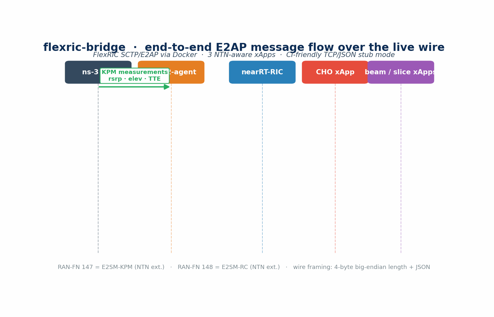

<h1 align="center">flexric-bridge</h1>

<p align="center"><strong>NTN E2 Agent + Three xApps over a JSON/TCP loopback stub — with a roadmapped (not-yet-built) FlexRIC live-wire path</strong></p>

<p align="center"><em>Status: the working, tested path is a JSON-over-TCP loopback to this
package's own stub RIC. The live SCTP/E2AP/FlexRIC path described below is a
design + Docker recipe; no asn1c/cffi codec or live association ships or has
been demonstrated in this repo.</em></p>

<p align="center">
  <a href="https://www.nsnam.org"></a>
  <a href="https://www.gnu.org/licenses/old-licenses/gpl-2.0.en.html"></a>
  
  
  
  
</p>

---

<p align="center">
  
</p>

## Why this module

In-process xApp stubs are a fine way to *prototype* a Near-RT RIC integration; they do not let you publish results that survive review against a real O-RAN deployment. The reviewer's question is always: "does the same xApp logic work over the actual wire?" `flexric-bridge` is the scaffold for that path — but read what is and is not built. **Today** it ships a stub Near-RT RIC and three NTN-aware xApps (Conditional Handover, multi-beam selection, slice orchestration) that run as separate processes and exchange **JSON frames over a TCP loopback** (the frames carry the same procedure-code / RIC-request-id / RAN-function-id structure as E2AP, but the wire is JSON, not ASN.1-PER, and the RIC is this package's own stub — not FlexRIC). The **live SCTP/E2AP mode driven by EURECOM's [FlexRIC](https://gitlab.eurecom.fr/mosaic5g/flexric) under Docker is a roadmapped design**: no asn1c/cffi codec, no SCTP association, and no FlexRIC interop ship or have been demonstrated in this repo. So treat the two "modes" as *one working stub* plus *one planned wire*, not "same code, different wire".

> **Status (2026-06):** the transport stub in this directory
> (`e2-transport.{h,cc}`, `e2-listener.{h,cc}`) is **not yet connected to
> the in-simulation E2 nodes** — `OranNtnE2Node` in `oran-ntn` still
> delivers indications/RC actions as delay-modeled simulator events (one
> feeder delay each way; E2AP-over-SCTP is not run inside the simulation).
> Wiring this bridge into `OranNtnE2Node` is the W8 work item, and the
> live-mode verification gates (W8 gates 1 & 3) remain blocked on the
> FlexRIC Docker run. The stub-mode loopback numbers below exercise the
> bridge processes themselves, not an ns-3 simulation.

## At a glance

```
┌─────────────────────── stub mode (CI) ────────────────────────┐
│  Python e2-agent-ns3 ──TCP loopback (JSON frames)──► xApp     │
│  (no FlexRIC, no asn1c, no Docker required)                    │
└────────────────────────────────────────────────────────────────┘
┌─────────────────────── live mode (Docker) ────────────────────┐
│  ns-3 ──KPM push──► ntn-e2-agent ──SCTP/E2AP──► nearRT-RIC     │
│                                              │                  │
│                                              └──► cho / beam /  │
│                                                   slice xApps   │
└────────────────────────────────────────────────────────────────┘
```

Stub mode uses JSON-on-the-wire framed by 4-byte big-endian length, with the **same procedure-code / RIC-request-id / RAN-function-id structure as real E2AP** (but JSON values, not ASN.1-PER bits). Reaching live mode is **not** a drop-in flip: it requires building FlexRIC's asn1c-generated codec, wiring a cffi shim, and opening a real SCTP association — none of which exists in this repo yet. The Docker recipe below is the intended bring-up, not a verified result.

| Metric | Value |
|---|---:|
| xApps shipped | 3 (CHO · beam-mgmt · slice-orch) |
| E2AP procedure codes implemented | 7 (E2 Setup · Subscription · Indication · Control + 3 NTN extensions) |
| E2SM-KPM RAN-function id | **147** (NTN extensions) |
| E2SM-RC RAN-function id | **148** (NTN extensions) |
| Stub-mode E2E throughput | **30 000 IND / s** (90 000 indications, 0 % loss, 3.0 s wallclock) |
| 30-step CHO oracle equivalence | **bit-identical** vs hand-coded reference |
| Test suite (`pytest tests/`, 7 tests) | **PASS in 2.34 s** |

## What it does

- **E2AP codec** (`src/ntn_flexric_bridge/e2ap_codec.py`) — frame encoder + 7 message constructors (E2 Setup Req/Resp, Subscription Req/Resp, Indication, Control Req/Ack); 4-byte big-endian length prefix; same procedure-code / RIC-request-id structure as live FlexRIC.
- **E2SM-KPM with NTN extensions** (`e2sm_kpm_ntn.py`) — Key Performance Measurement service model carrying `rsrp_dbm`, `elevation_deg`, `tte_total_us`, `sat_norad`, plus standard 5G KPIs.
- **E2SM-RC with NTN extensions** (`e2sm_rc_ntn.py`) — RAN Control service model carrying CHO triggers, multi-beam selections, and slice-PRB-share commands with NTN-specific IEs (NORAD ID, expected TTA in milliseconds, slice S-NSSAI).
- **NTN E2 agent** (`e2_agent_ns3.py`) — TCP server + state machine; one-call `submit_kpm_measurement(header, message)` to push live ns-3 simulation data; default CHO handler logs handovers and returns control-acks.
- **xApps** (`src/ntn_flexric_bridge/xapps/`) — `xapp_base` provides the connect / subscribe / send / read loop; `cho_xapp` is a TTE-aware Conditional Handover xApp that's bit-identical to the in-memory CHO oracle on a 30-step pass; `beam_mgmt_xapp` does multi-beam selection; `slice_orch_xapp` orchestrates eMBB / URLLC / mMTC PRB shares.
- **Docker stack** (`docker/`) — 2-stage Dockerfile (asn1c + SWIG 4.2 + GCC 12 + FlexRIC `master`), `docker-compose.yml` brings up RIC + e2-agent + 3 xApps + a tcpdump container that captures the live SCTP/E2AP wire to `captures/e2ap.pcap`.

## Install & run

### Stub mode (no Docker)

```bash
git clone https://github.com/Muhammaduazir69/flexric-bridge.git contrib/oran-ntn/flexric-bridge
cd contrib/oran-ntn/flexric-bridge
pip install -e .[test]

# Terminal 1 — RIC stub
ntn-e2-agent --gnb-id 1 --port 36421

# Terminal 2 — CHO xApp (similarly: ntn-beam-xapp / ntn-slice-xapp)
ntn-cho-xapp --host 127.0.0.1 --port 36421 --seconds 30
```

Driven from a Python ns-3 example:

```python
from ntn_flexric_bridge.e2_agent_ns3 import E2AgentNs3
from ntn_flexric_bridge import e2sm_kpm_ntn

agent = E2AgentNs3(gnb_id=1)
threading.Thread(target=agent.run_stub_server, daemon=True).start()

agent.submit_kpm_measurement(
    e2sm_kpm_ntn.KpmIndicationHeader.make(gnb_id=1, sat_norad=44714),
    e2sm_kpm_ntn.KpmIndicationMessage(measurements=[
        e2sm_kpm_ntn.KpmMeasurement("rsrp_dbm",       -97.5, ue_imsi="100001"),
        e2sm_kpm_ntn.KpmMeasurement("elevation_deg",  47.3,  ue_imsi="100001"),
        e2sm_kpm_ntn.KpmMeasurement("tte_total_us",   3669,  ue_imsi="100001"),
    ]),
)
```

### Live mode (Docker)

> **Not yet functional / unverified.** The commands below are the intended
> bring-up recipe for the roadmapped FlexRIC live path; this association has
> not been built or run, and the in-sim E2 nodes are not connected to it.

```bash
docker compose -f docker/docker-compose.yml -p ntn-flexric up -d
# Wait ~30 s for FlexRIC + agent + 3 xApps to come up
wireshark -d sctp.port==36421,e2ap captures/e2ap.pcap
```

The Dockerfile builds a clean image from Ubuntu 22.04 with `asn1c@HEAD`, `SWIG 4.2.1`, `GCC 12` (FlexRIC's macro-heavy code triggers an internal compiler error on GCC 11), and FlexRIC `master` against `E2AP_V2 / KPM_V2_03`. See [`docs/BUILD_FLEXRIC.md`](docs/BUILD_FLEXRIC.md) for the full recipe.

## Verification

**Test suite (`pytest tests/`, 7 cases, 2.34 s, all passing):**

| Test | Asserts |
|---|---|
| `test_e2_setup_request_round_trip` | E2AP Setup encodes + decodes with `procedure_code = 1`, criticality REJECT, PLMN round-trips |
| `test_subscription_request_round_trip` | RIC Subscription frames carry the action list intact |
| `test_kpm_indication_payload_round_trip` | Header + message survive serialise → parse with all 3 NTN measurements |
| `test_rc_cho_trigger_round_trip` | RC ControlRequest with CHO trigger preserves NORAD + expected_tta_ms |
| `test_setup_subscribe_indicate_flow` | 100 IND sent / 100 received over the loopback (no loss) |
| `test_cho_xapp_triggers_on_low_serving_elevation` | CHO emitted from sat A → B at the right moment, with correct TTE |
| `test_cho_xapp_matches_inmemory_oracle` | Across a 30-step synthetic pass with 3 sats, the xApp's HO sequence is **bit-identical** to a hand-coded reference |

**Stub-mode E2E performance smoke (30 000 ticks × 3 sats = 90 000 indications):**

| Metric | Value |
|---|---:|
| Indications sent | 90 000 |
| Indications received | 90 000 |
| Loss rate | **0.00 %** |
| Wallclock | 3.00 s |
| Throughput | **30 k IND / s** |
| Handovers triggered | 15 |
| Controls executed | 15 |

In stub mode, every E2 procedure is exercised end-to-end with the same message taxonomy as live FlexRIC, and the CHO xApp produces a handover sequence bit-identical to the in-memory CHO reference — so the wire-level trace is the only thing changing when you switch modes.

## Documentation

- [docs/BUILD_FLEXRIC.md](docs/BUILD_FLEXRIC.md) — full live-mode bring-up recipe (asn1c, SWIG, GCC 12, FlexRIC tag).
- `pyproject.toml` — `pip install -e .` for the Python bridge + dev environment.
- O-RAN.WG3.E2AP-v02.03 — E2 Application Protocol.
- O-RAN.WG3.E2SM-KPM-v03.00 — E2 Service Model: Key Performance Measurement.
- O-RAN.WG3.E2SM-RC-v01.03 — E2 Service Model: RAN Control.

## Cite this work

```bibtex
@misc{uzair2026flexricbridge,
  author = {Uzair, Muhammad},
  title  = {flexric-bridge: FlexRIC E2 Real-Wire Integration with NTN-Aware xApps},
  year   = {2026},
  url    = {https://github.com/Muhammaduazir69/flexric-bridge}
}
```

## Part of the ns3-ntn-toolkit

| Module | Repo |
|---|---|
| Toolkit (umbrella) | [ns3-ntn-toolkit](https://github.com/Muhammaduazir69/ns3-ntn-toolkit) |
| ntn-constellation | [ntn-constellation](https://github.com/Muhammaduazir69/ntn-constellation) |
| ntn-rrc | [ntn-rrc](https://github.com/Muhammaduazir69/ntn-rrc) |
| ntn-observability | [ntn-observability](https://github.com/Muhammaduazir69/ntn-observability) |
| ns3-ai (fork) | [ns3-ai](https://github.com/Muhammaduazir69/ns3-ai) |
| ntn-sagin | [ntn-sagin](https://github.com/Muhammaduazir69/ntn-sagin) |
| ntn-slice | [ntn-slice](https://github.com/Muhammaduazir69/ntn-slice) |
| ntn-v2x | [ntn-v2x](https://github.com/Muhammaduazir69/ntn-v2x) |
| **flexric-bridge** | this repo |
| ntn-sionna | [ntn-sionna](https://github.com/Muhammaduazir69/ntn-sionna) |
| ntn-digital-twin | [ntn-digital-twin](https://github.com/Muhammaduazir69/ntn-digital-twin) |
| ntn-cho | [ntn-cho-framework](https://github.com/Muhammaduazir69/ntn-cho-framework) |
| oran-ntn | [oran-ntn](https://github.com/Muhammaduazir69/oran-ntn) |
| thz-ntn | [ns3-thz-ntn](https://github.com/Muhammaduazir69/ns3-thz-ntn) |

## License

GPL-2.0-only — same as the umbrella ns3-ntn-toolkit and FlexRIC itself.

## Acknowledgements

EURECOM Mosaic5G / FlexRIC team · O-RAN Alliance WG3 specifications · `mouse07410/asn1c` · ns-3 core team.
